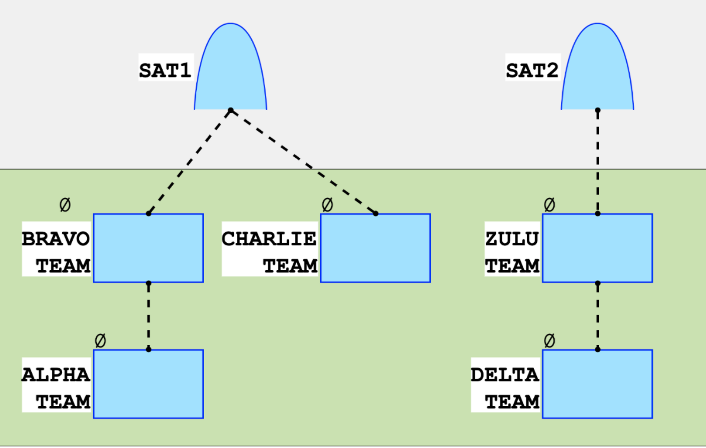

# CSharp solution for SDET coding Ttst
Contains a CSHARP solution for the DU SDET Test.



This repo contains a console application, a class library for the engine and some unit tests.

## How to run the console application from command line
1. Set project to Release mode then from Build, Click Publish to folder.
2. Type the example input command: 
```
dotnet Communicator.dll "Alpha,Bravo
Bravo,Alpha, SAT1
SAT1,Bravo , Charlie
Charlie, SAT1
Delta  ,Zulu
Zulu,Delta, SAT2
SAT2,  Zulu"
```

3. Output 
```
3
``` 

## How to run tests from the command line:

   ```
   dotnet test Communicator.Tests.dll
   ```

## Assumptions :
Lowercase SAT would be rejected <BR>
Can have as many duplicate Team names in input but would still be grouped distictly<BR>
Teams can talk over any number of Satalites.<BR>
Team names can not be 0 chars long<BR>
Team names can't have spaces in them<BR>
